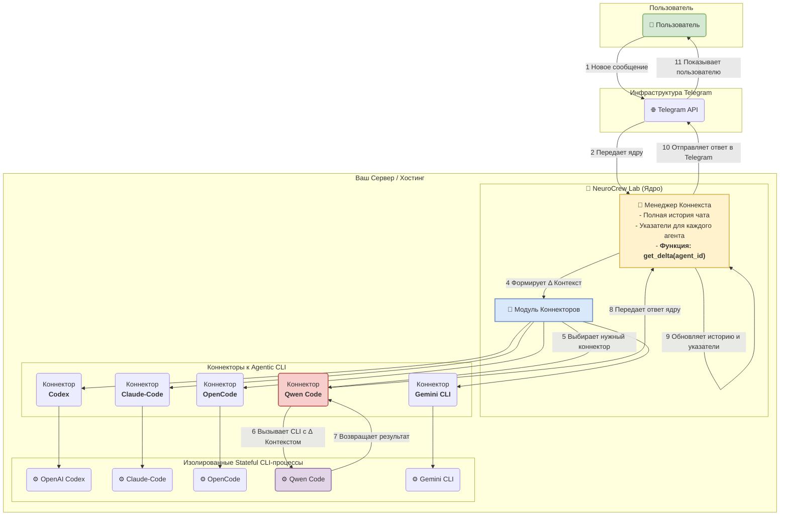

Понимаю. Вам нужна полная, структурированная спецификация для MVP (Minimum Viable Product), которую можно передать команде разработки.

Вот документ, который описывает проект **"NeuroCrew Lab"** от концепции до конкретных технических требований для создания первой рабочей версии.

---

### **Техническая Спецификация: MVP "NeuroCrew Lab"**

**1. Видение Продукта**

Создать платформу для совместной работы нескольких LLM-агентов (Agentic CLI) в формате чата, управляемого пользователем. Система, названная "NeuroCrew Lab", будет действовать как центральный оркестратор, который последовательно вызывает разных агентов для решения одной общей задачи, поддерживая единый контекст диалога.

**2. Ключевые Концепции**

*   **Ядро (NeuroCrew Lab):** Центральное приложение, которое управляет всем процессом.
*   **Агент (Agentic CLI):** Внешний, автономный CLI-инструмент (Qwen Code, Gemini CLI и т.д.), который умеет хранить собственный контекст.
*   **Коннектор:** Программный "адаптер" внутри Ядра, который знает, как общаться с конкретным Агентом (как его запустить, как передать данные, как прочитать ответ).
*   **"Дельта" Контекста:** Набор сообщений, которые произошли в чате с момента последнего ответа конкретного Агента. Это та информация, которую Агент "пропустил" и которую ему нужно передать для обновления его внутреннего состояния.

**3. MVP: Требования и Ограничения**

**Что входит в MVP:**
*   **Интерфейс:** Только через чат-бота в Telegram.
*   **Очередь Агентов:** Жестко заданная, циклическая последовательность (например, Qwen -> Gemini -> Claude -> ...).
*   **Взаимодействие:** Строго последовательное. Одновременно работает только один Агент.
*   **Управление состоянием:** Хранение истории диалога и указателей для Агентов в оперативной памяти. **При перезапуске приложения история теряется.**
*   **Поддерживаемые Агенты:**
    1.  Qwen Code
    2.  Gemini CLI
    3.  Claude-Code
    4.  OpenCode
    5.  OpenAI Codex
*   **Обработка ошибок:** Базовая обработка (таймауты, ошибки запуска CLI) с выводом сообщения об ошибке в чат.

**Что НЕ входит в MVP:**
*   Веб-интерфейс или любая другая точка входа, кроме Telegram.
*   Динамическое управление очередью Агентов.
*   Параллельное выполнение задач несколькими Агентами.
*   Сохранение состояния диалогов в базе данных.
*   Управление пользователями, аутентификация.

**4. Системная Архитектура**



**5. Спецификация Компонентов**

#### **A. Telegram Бот (`telegram_bot.py`)**

*   **Задача:** Служить "тонким клиентом". Принимать сообщения от пользователя и передавать их Ядру. Получать ответы от Ядра и отправлять их пользователю.
*   **Библиотека:** Рекомендуется `python-telegram-bot` или `aiogram`.
*   **Команды MVP:**
    *   `/start` - Приветственное сообщение.
    *   `/reset` - Полностью очищает историю диалога и сбрасывает состояние всех Агентов.
*   **Логика:** При получении любого текстового сообщения (не команды), бот вызывает соответствующий метод Ядра `NeuroCrewLab.handle_message(text)`.

#### **B. Ядро (`ncrew.py`)**

*   **Задача:** Содержать всю бизнес-логику приложения.
*   **Класс:** `NeuroCrewLab`
*   **Управление состоянием (атрибуты класса):**
    *   `conversation_history: list[dict]` - Полная история диалога. Каждый элемент - `{"role": "user" | "agent_name", "content": "..."}`.
    *   `agent_sequence: list[str]` - Жестко заданный порядок Агентов, например `['qwen', 'gemini', ...]`.
    *   `current_agent_index: int` - Индекс текущего агента в `agent_sequence`.
    *   `agent_pointers: dict[str, int]` - Словарь, где ключ - имя агента, значение - индекс в `conversation_history`, на котором этот агент остановился.
    *   `connectors: dict[str, BaseConnector]` - Словарь с инстансами всех загруженных коннекторов.
*   **Основной метод `handle_message(user_text: str)`:**
    1.  Добавить сообщение пользователя в `conversation_history`.
    2.  Определить следующего агента для ответа (`agent_name = self.agent_sequence[self.current_agent_index]`).
    3.  Вычислить "дельту" контекста для этого агента: `delta = self.conversation_history[self.agent_pointers[agent_name]:]`.
    4.  Вызвать коннектор: `connector = self.connectors[agent_name]`, `response = connector.execute(delta)`.
    5.  Добавить ответ агента в `conversation_history`.
    6.  Обновить указатель: `self.agent_pointers[agent_name] = len(self.conversation_history)`.
    7.  Обновить индекс для следующего хода: `self.current_agent_index = (self.current_agent_index + 1) % len(self.agent_sequence)`.
    8.  Вернуть ответ агента для отправки пользователю.

#### **C. Модуль Коннекторов (`connectors/`)**

*   **Задача:** Обеспечить унифицированный способ общения с разнородными CLI.
*   **Базовый интерфейс (`connectors/base.py`):** Необходимо создать абстрактный базовый класс, чтобы все коннекторы имели одинаковую структуру.

    ```python
    from abc import ABC, abstractmethod
    
    class BaseConnector(ABC):
        @abstractmethod
        def execute(self, delta_context: list[dict]) -> str:
            """
            Принимает дельту контекста, выполняет CLI-агент и возвращает его ответ.
            """
            pass
    ```
*   **Реализация коннектора (`connectors/qwen_connector.py`):**
    *   Наследуется от `BaseConnector`.
    *   Реализует метод `execute`.
    *   Внутри использует `subprocess.run()` для вызова `qwen-code`.
    *   Форматирует `delta_context` в строку-промпт.
    *   Обрабатывает ошибки (таймаут, код возврата).
    *   *Подробную спецификацию см. в предыдущем ответе.*
*   **Задача для разработчика:** Создать по одному файлу-реализации коннектора для каждого из 5 целевых Агентов, следуя этому шаблону.

**6. Окружение и Запуск**

*   **Зависимости:** Должен быть предоставлен файл `requirements.txt`.
*   **Конфигурация:**
    *   Токен Telegram-бота должен считываться из переменной окружения `TELEGRAM_BOT_TOKEN`.
    *   Пути к исполняемым файлам каждого CLI-агента должны задаваться через переменные окружения (например, `QWEN_CLI_PATH`, `GEMINI_CLI_PATH`).
*   **Запуск:** Простое выполнение главного Python-скрипта (`python main.py`), который инициализирует Ядро и запускает Telegram-бота.

**7. План Разработки (Рекомендация)**

1.  **Этап 1 (Каркас):** Создать структуру проекта, классы `NeuroCrewLab` и `BaseConnector`. Реализовать запуск Telegram-бота и простейшую логику "эхо" без вызова агентов.
2.  **Этап 2 (Первая интеграция):** Полностью реализовать один коннектор, например, `QwenCodeConnector`. Интегрировать его в Ядро. Добиться первого сквозного диалога: `Пользователь -> Бот -> Ядро -> Коннектор -> CLI -> ... -> Пользователь`.
3.  **Этап 3 (Масштабирование):** Реализовать остальные 4 коннектора по уже отработанному шаблону. Добавить логику циклической очереди в Ядро.
4.  **Этап 4 (Завершение MVP):** Реализовать команду `/reset`. Провести тестирование и отладку. Подготовить инструкции по развертыванию.