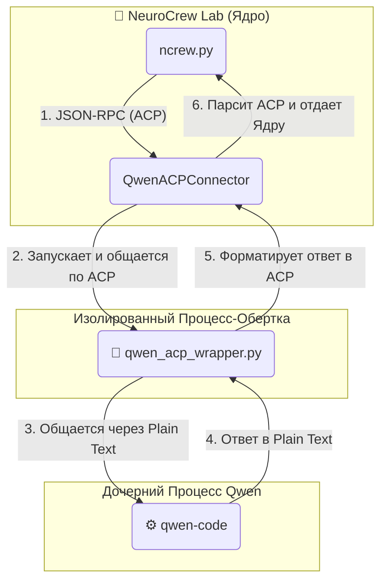

### **Техническая Спецификация: Рефакторинг Qwen Connector на базу ACP**

**1. Видение и Цель**

**Проблема:** Текущая реализация `QwenConnector` использует эвристический подход с таймаутом (`_read_until_timeout`) для определения конца ответа от CLI-процесса. Этот метод ненадежен, может приводить к обрезанию ответов или излишним задержкам, и является основной точкой нестабильности в системе.

**Цель:** Полностью устранить эту проблему для Qwen, внедрив детерминированный протокол общения **ACP (Agent Communication Protocol)**. Это повысит надежность, предсказуемость и производительность взаимодействия с Qwen-агентами. Старый коннектор должен быть полностью удален.

**2. Ключевое Архитектурное Изменение: Внедрение Wrapper-Процесса**

Мы переходим от прямого взаимодействия с `qwen-code` к взаимодействию через **скрипт-обертку (Wrapper)**.

1.  `NeuroCrew Lab` запускает не `qwen-code`, а наш кастомный Python-скрипт `qwen_acp_wrapper.py`.
2.  `NeuroCrew Lab` общается с этим скриптом по строгому протоколу ACP (JSON-RPC через `stdin/stdout`).
3.  Скрипт-обертка, в свою очередь, запускает и управляет настоящим процессом `qwen-code`, транслируя структурированные ACP-запросы в простой текст и обратно.

**Новая схема взаимодействия:**


---

**3. Спецификация Компонентов**

#### **Задача 1: Создать скрипт-обертку `qwen_acp_wrapper.py`**

Это новый, ключевой компонент. Он служит "переводчиком" между нашим надежным протоколом ACP и простым текстовым вводом/выводом `qwen-code`.

**Действие:** Создать файл `connectors/qwen_acp_wrapper.py` со следующим содержимым.

```python
# connectors/qwen_acp_wrapper.py
import asyncio
import json
import sys
import os
import logging

# Настройка базового логирования для отладки самого wrapper'а
logging.basicConfig(filename='/tmp/qwen_wrapper.log', level=logging.INFO,
                    format='%(asctime)s - %(levelname)s - %(message)s')

# --- Функции для работы с Agent Communication Protocol (ACP) ---

async def read_acp_message(reader):
    """Читает одно сообщение по протоколу ACP из потока."""
    headers = {}
    while True:
        line = await reader.readline()
        if not line: # Конец потока
            return None
        if line.strip() == b'': # Конец заголовков
            break
        key, value = line.decode().strip().split(': ', 1)
        headers[key] = value

    if 'Content-Length' not in headers:
        logging.error("ACP Read Error: No Content-Length header.")
        return None

    content_len = int(headers['Content-Length'])
    content = await reader.readexactly(content_len)
    return json.loads(content.decode('utf-8'))

def write_acp_message(writer, message):
    """Записывает одно сообщение по протоколу ACP в поток."""
    msg_json = json.dumps(message).encode('utf-8')
    header = f"Content-Length: {len(msg_json)}\r\n\r\n".encode('utf-8')
    writer.write(header + msg_json)

# --- Главная логика обертки ---

async def main():
    """Основной цикл работы обертки."""
    try:
        qwen_process = await asyncio.create_subprocess_exec(
            'qwen-code', # Предполагаем, что команда доступна в PATH
            stdin=asyncio.subprocess.PIPE,
            stdout=asyncio.subprocess.PIPE,
            stderr=asyncio.subprocess.PIPE
        )
        logging.info(f"Qwen-code process started with PID {qwen_process.pid}")
    except FileNotFoundError:
        logging.error("Fatal: 'qwen-code' command not found in PATH.")
        return

    # Настраиваем чтение из stdin и запись в stdout для общения с NeuroCrew
    parent_reader = asyncio.StreamReader()
    await asyncio.get_event_loop().connect_read_pipe(
        lambda: asyncio.StreamReaderProtocol(parent_reader), sys.stdin
    )
    
    parent_writer_transport, parent_writer_protocol = await asyncio.get_event_loop().connect_write_pipe(
        asyncio.streams.FlowControlMixin, sys.stdout
    )
    parent_writer = asyncio.StreamWriter(parent_writer_transport, parent_writer_protocol, None, asyncio.get_event_loop())

    # Основной цикл обработки запросов
    while True:
        request_id = None
        try:
            request = await read_acp_message(parent_reader)
            if request is None:
                logging.info("Parent process closed the pipe. Exiting.")
                break
            
            request_id = request.get("id")
            prompt = request.get('params', {}).get('prompt', '')

            # Отправляем промпт в qwen-code
            qwen_process.stdin.write(f"{prompt}\n".encode('utf-8'))
            await qwen_process.stdin.drain()

            # Читаем ответ от qwen-code (единственная оставшаяся эвристика)
            response_lines = []
            while True:
                try:
                    line = await asyncio.wait_for(qwen_process.stdout.readline(), timeout=2.5)
                    if not line: break
                    decoded_line = line.decode('utf-8').strip()
                    if decoded_line != prompt: # Простое удаление эха
                         response_lines.append(decoded_line)
                except asyncio.TimeoutError:
                    break # Считаем, что qwen закончил отвечать
            
            qwen_response = "\n".join(response_lines)

            # Формируем и отправляем ACP-ответ
            response_message = {
                "jsonrpc": "2.0", "id": request_id,
                "result": {"response": qwen_response}
            }
            write_acp_message(parent_writer, response_message)
            await parent_writer.drain()

        except Exception as e:
            logging.error(f"Error during request processing: {e}")
            error_response = {
                "jsonrpc": "2.0", "id": request_id,
                "error": {"code": -32603, "message": str(e)}
            }
            write_acp_message(parent_writer, error_response)
            await parent_writer.drain()

if __name__ == "__main__":
    # Отключаем переменные прокси, чтобы они не мешали дочерним процессам
    for var in ['HTTP_PROXY', 'HTTPS_PROXY', 'ALL_PROXY', 'http_proxy', 'https_proxy', 'all_proxy']:
        os.environ.pop(var, None)
    
    asyncio.run(main())
```

#### **Задача 2: Создать новый `QwenACPConnector`**

Этот коннектор заменяет старый. Он реализует тот же интерфейс `BaseConnector`, но внутри использует ACP для общения с `qwen_acp_wrapper.py`.

**Действие:** Создать файл `connectors/qwen_acp_connector.py`.

```python
# connectors/qwen_acp_connector.py
import asyncio
import json
from .base import BaseConnector

class QwenACPConnector(BaseConnector):
    """
    Stateful-коннектор для Qwen, использующий ACP (Agent Communication Protocol).
    Эта реализация полностью заменяет эвристику с таймаутами на надежный протокол.
    """
    def __init__(self):
        super().__init__()
        self.message_id_counter = 0

    async def launch(self, command: str, system_prompt: str):
        """
        Запускает процесс-обертку qwen_acp_wrapper.py.
        'command' здесь - это команда для запуска wrapper'а.
        """
        if self.is_alive():
            self.logger.debug("Qwen ACP wrapper process already running.")
            return

        command_parts = command.split()
        self.process = await asyncio.create_subprocess_exec(
            *command_parts,
            stdin=asyncio.subprocess.PIPE,
            stdout=asyncio.subprocess.PIPE,
            stderr=asyncio.subprocess.PIPE, # Важно для отладки wrapper'а
            env=self._get_clean_env()
        )
        self.logger.info(f"Launched Qwen ACP Wrapper (PID: {self.process.pid})")

        # Отправляем системный промпт как первое "исполняемое" сообщение
        await self.execute(system_prompt)
        self.logger.info("System prompt sent to initialize Qwen via ACP wrapper.")

    async def execute(self, delta_prompt: str) -> str:
        """Отправляет ACP-сообщение обертке и читает детерминированный ответ."""
        if not self.is_alive():
            raise RuntimeError("Qwen ACP Wrapper process is not running.")

        self.message_id_counter += 1
        request = {
            "jsonrpc": "2.0",
            "id": self.message_id_counter,
            "method": "process",
            "params": {"prompt": delta_prompt}
        }
        
        await self._send_acp_message(request)
        response = await self._read_acp_message()

        if "result" in response:
            return response["result"].get("response", "")
        elif "error" in response:
            error_msg = response["error"].get("message", "Unknown error from wrapper")
            self.logger.error(f"ACP Wrapper Error: {error_msg}")
            return f"❌ Error from Qwen Wrapper: {error_msg}"
        else:
            return "❌ Error: Invalid or empty response from Qwen ACP Wrapper."

    # --- Приватные методы для работы с ACP ---

    async def _send_acp_message(self, message: dict):
        """Формирует и отправляет сообщение по протоколу ACP."""
        msg_json = json.dumps(message).encode('utf-8')
        header = f"Content-Length: {len(msg_json)}\r\n\r\n".encode('utf-8')
        self.process.stdin.write(header + msg_json)
        await self.process.stdin.drain()

    async def _read_acp_message(self) -> dict:
        """Читает одно сообщение по протоколу ACP."""
        try:
            headers = {}
            while True:
                line = await self.process.stdout.readline()
                if not line or line.strip() == b'': break
                key, value = line.decode('utf-8').strip().split(': ', 1)
                headers[key] = value

            if 'Content-Length' not in headers:
                stderr_data = await self.process.stderr.read(1024)
                raise RuntimeError(f"ACP Protocol Error: No Content-Length. Stderr: {stderr_data.decode()}")

            content_len = int(headers['Content-Length'])
            content = await self.process.stdout.readexactly(content_len)
            return json.loads(content.decode('utf-8'))
        except (asyncio.IncompleteReadError, ConnectionResetError, BrokenPipeError) as e:
            raise RuntimeError(f"Pipe to wrapper process broken: {e}")

```

#### **Задача 3: Интеграция в Основное Приложение**

**Действие 1: Обновить `roles/agents.yaml`**

Нужно изменить одну из ролей, чтобы она использовала новый коннектор.

```yaml
# roles/agents.yaml

roles:
  - role_name: software_developer
    display_name: "Software Developer"
    telegram_bot_name: SoftwareDevBot
    system_prompt_file: "roles/prompts/software_developer.md"
    # --- ИЗМЕНЕНИЯ ---
    agent_type: "qwen_acp"  # 1. Новый, уникальный тип агента
    cli_command: "python3 connectors/qwen_acp_wrapper.py" # 2. Команда для запуска wrapper'а
    # --- КОНЕЦ ИЗМЕНЕНИЙ ---
    description: "Старший разработчик на базе надежного ACP коннектора"
  
  # ... (остальные роли могут пока использовать старый 'qwen' тип)
```

**Действие 2: Обновить `ncrew.py`**

Научить "фабрику коннекторов" создавать наш новый `QwenACPConnector`.

```python
# ncrew.py -> NeuroCrewLab -> _create_connector_for_role()

    def _create_connector_for_role(self, role):
        agent_type = role.agent_type.lower()

        from connectors import qwen_connector, claude_connector, codex_connector, gemini_connector
        # --- ИЗМЕНЕНИЯ ---
        from connectors.qwen_acp_connector import QwenACPConnector # 1. Импортируем новый класс

        connector_classes = {
            'qwen': qwen_connector.QwenConnector,
            'qwen_acp': QwenACPConnector, # 2. Добавляем новый тип в словарь
            'claude': claude_connector.ClaudeConnector,
            'codex': codex_connector.CodexConnector,
            'gemini': gemini_connector.GeminiConnector
        }
        # --- КОНЕЦ ИЗМЕНЕНИЙ ---
        
        connector_class = connector_classes.get(agent_type)
        if not connector_class:
            raise ValueError(f"Unsupported agent type: {agent_type}")

        return connector_class()
```

**Действие 3: Очистка проекта (Критически важно!)**

После того как новый коннектор протестирован и работает стабильно, старый нужно удалить, чтобы не создавать путаницы.

*   **Удалить файл:** `connectors/qwen_connector.py`.
*   **Обновить `roles/agents.yaml`:** Заменить все `agent_type: "qwen"` на `agent_type: "qwen_acp"`.
*   **Обновить `ncrew.py`:** Удалить `qwen` из словаря `connector_classes`.

---

**4. План Реализации**

1.  **Шаг 1:** Создать файлы `connectors/qwen_acp_wrapper.py` и `connectors/qwen_acp_connector.py` с кодом из этой спецификации.
2.  **Шаг 2:** Внести изменения в `roles/agents.yaml` для одной тестовой роли.
3.  **Шаг 3:** Внести изменения в `ncrew.py`, чтобы система знала о новом типе `"qwen_acp"`.
4.  **Шаг 4:** Провести сквозное тестирование: отправить сообщение в чат и убедиться, что роль `software_developer` отвечает корректно. Проверить лог-файл `/tmp/qwen_wrapper.log` для отладки.
5.  **Шаг 5 (финальный):** После успешного тестирования, выполнить "Действие 3: Очистка проекта", чтобы полностью перейти на новую реализацию.

**5. Критерии Готовности (Definition of Done)**

1.  Взаимодействие с Qwen-агентами происходит через `QwenACPConnector` и `qwen_acp_wrapper.py`.
2.  В коде `QwenACPConnector` отсутствует метод `_read_until_timeout` или любая другая эвристика, основанная на задержках.
3.  Система успешно обрабатывает сообщения через Qwen-роли.
4.  Старый файл `connectors/qwen_connector.py` удален из проекта.
5.  Код чист, хорошо документирован и не содержит "мертвых" веток, относящихся к старому коннектору.

**6. Преимущества Нового Подхода**

*   **Надежность:** Полностью устраняется проблема "угадывания" конца ответа агента.
*   **Производительность:** Сохраняются все преимущества stateful-подхода (один запуск процесса).
*   **Отладка:** Упрощается отладка. Проблемы теперь четко разделены: либо это проблема протокола (в `QwenACPConnector`), либо проблема взаимодействия с CLI (в `qwen_acp_wrapper.py`).