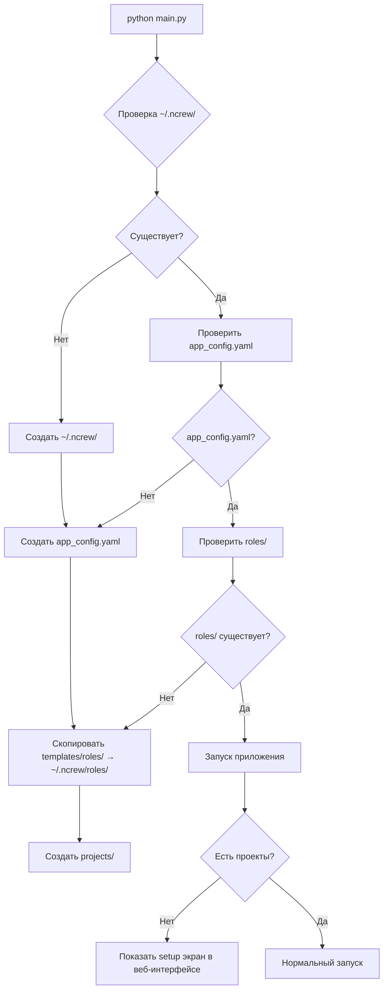

# Исправление структуры хранения и восстановление ролей

**Тип:** Refactor / Infrastructure
**Приоритет:** Critical
**Workflow:** [refactor.md](../workflows/refactor.md)

**Описание:**
Исправить структуру хранения в ~/.ncrew/ и восстановить дефолтные роли, которые были удалены во время рефакторинга. Перейти на правильную архитектуру с разделением глобальной конфигурации и проектов.

---

### 1. Текущие проблемы

1. **Удалены дефолтные роли** - в git истории была папка `roles/` с 10 ролями и промптами
2. **Отсутствует глобальная конфигурация** - нет `~/.ncrew/app_config.yaml`
3. **Авто-создание проекта** - приложение создает "default" проект без спроса
4. **Неправильная структура** - смешение глобальных и проектных настроек

### 2. Целевая структура

#### В репозитории:
```
templates/
└── roles/                    # Дефолтные роли для копирования
    ├── agents.yaml          # 10 ролей по умолчанию
    └── prompts/             # Промпты для ролей (10 файлов .md)
        ├── code_review.md
        ├── devops_senior.md
        ├── product_analyst.md
        ├── product_owner.md
        ├── scrum_master.md
        ├── sdet_senior.md
        ├── security_analyst.md
        ├── senior_architect.md
        ├── software_developer.md
        └── system_analyst.md
```

#### В ~/.ncrew/ после первого запуска:
```
~/.ncrew/
├── app_config.yaml          # Глобальная конфигурация приложения
├── roles/                   # Скопированные дефолтные роли
│   ├── agents.yaml
│   └── prompts/
└── projects/                # Проекты (пустая папка изначально)
    └── .gitkeep
```

### 3. Задачи по реализации

#### Задача 1: Восстановление templates/roles/
* **Action:** Восстановить папку `templates/roles/` из git истории (HEAD~5)
* **Verify:** Проверить наличие 10 ролей в `agents.yaml` и 10 промптов

#### Задача 2: Создание глобальной конфигурации
* **Action:** Добавить `app_config.yaml` в `~/.ncrew/`
* **Content:**
  ```yaml
  version: "1.0"
  first_run: true
  default_project: null
  web_port: 8080
  log_level: INFO
  ```

#### Задача 3: Обновление MultiProjectManager
* **Action:** Изменить логику инициализации:
  - Не создавать проект "default" автоматически
  - Копировать дефолтные роли из `templates/roles/` в `~/.ncrew/roles/`
  - Создавать пустую папку `projects/`

#### Задача 4: Обновление ncrew.sh
* **Action:** Убрать проверки токенов, добавить проверку структуры:
  ```bash
  # Проверить наличие ~/.ncrew/roles/
  # Если нет - скопировать из templates/roles/
  ```

#### Задача 5: Обновление Config
* **Action:** Разделить глобальную и проектную конфигурацию:
  - `app_config.yaml` - глобальные настройки
  - `project/config.yaml` - настройки проекта

---

### 4. Процесс первого запуска



---

### 5. Критерии приемки

1. **Структура восстановлена:**
   - ✅ `templates/roles/` содержит 10 ролей и 10 промптов
   - ✅ При первом запуске создается `~/.ncrew/roles/`
   - ✅ `~/.ncrew/app_config.yaml` существует

2. **Нет авто-создания проекта:**
   - ✅ Нет папки `~/.ncrew/default/`
   - ✅ Веб-интерфейс показывает setup экран при отсутствии проектов

3. **Роли доступны:**
   - ✅ Веб-интерфейс позволяет выбрать из 10 дефолтных ролей
   - ✅ Промпты копируются и доступны для редактирования

4. **Конфигурация разделена:**
   - ✅ Глобальные настройки в `app_config.yaml`
   - ✅ Проектные настройки в `projects/<name>/config.yaml`</content>
<parameter name="filePath">.memory_bank/specs/20251125_4_structure_fix.md