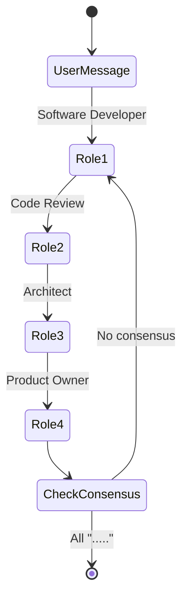

# 🚀 NeuroCrew Lab: Проектный индекс MVP

**Версия**: MVP v1.0.0
**Статус**: ✅ PRODUCTION READY
**Фокус**: Простота и базовая функциональность
**Дата**: 10 ноября 2025 г.

---

## 🎯 **О проекте**

**NeuroCrew Lab** — это Telegram-платформа для orchestration AI-агентов, предоставляющая **виртуальную команду разработки** из 10 специализированных экспертов для быстрого создания MVP и прототипов.

### **Ключевая инновация**
- **Multi-agent orchestration** vs одиночные AI ассистенты
- **Puppet Master architecture** с управлением множественными bot-актерами
- **Continuous autonomous dialogue** для достижения консенсуса
- **Russian-language native support** с локализованной экспертизой
- **🔌 Extensible connector ecosystem** - масштабируемая архитектура для любых AI провайдеров

### **MVP Философия**
- ✅ **Простота** - Минимум настроек, запуск за 5 минут
- ✅ **Работает** - Стабильная базовая функциональность
- ✅ **Доступно** - Русский язык, нулевой порог входа
- ✅ **Практично** - Решение реальных задач стартапов

---

## 🏗️ **Архитектура**

### **Puppet Master Pattern**
```
User → Telegram Group → Listener Bot → NeuroCrew Core → Role Sequence → CLI Agents → Actor Bots → Group Chat
```

### **Основные компоненты**

#### **🤖 Core Application**
```
main.py (Entry Point)
├── async_main() - Lifecycle management
├── graceful_shutdown() - Graceful termination
└── Signal handling - Ctrl+C support

ncrew.py (Business Logic)
├── handle_message() - Message processing
├── _process_with_role() - Role execution
├── shutdown_role_sessions() - Session cleanup
└── Continuous autonomous dialogue cycle

telegram_bot.py (Interface)
├── handle_message() - Telegram message handling
├── _ensure_ncrew_initialized() - Lazy initialization
├── shutdown() - Graceful bot termination
└── Puppet Master coordination
```

#### **🔌 AI Интеграции (Расширяемая архитектура)**
```
connectors/
├── base.py - Abstract connector class
│   ├── Unified interface for all AI providers
│   ├── Common functionality (deadlock detection, timeouts)
│   └── CLI-first communication layer (no API keys stored)
├── gemini_acp_connector.py - Gemini CLI integration
│   ├── Enhanced deadlock detection
│   ├── Streaming response handling
│   └── Timeout optimization
├── qwen_acp_connector.py - Qwen CLI integration
│   ├── Stateful sessions
│   └── Bidirectional communication
└── [future connectors] - Extensible architecture for any AI provider
    ├── claude_code_connector.py (planned)
    ├── github_copilot_connector.py (planned)
    ├── local_llm_connector.py (planned)
    └── custom_cli_connector.py (planned)
```

**🔒 Архитектурные принципы:**
- 🔌 **CLI-first approach** - Работаем только с предварительно аутентифицированными CLI
- ❌ **Zero API key storage** - Не храним ключи AI провайдеров
- 🎯 **Единый интерфейс** - Все коннекторы следуют одному API
- ⚡ **User-controlled auth** - Пользователь отвечает за авторизацию CLI
- 🚀 **Protocol-agnostic** - Поддержка любых CLI интерфейсов

#### **🤖 Ролевая система (10 ролей)**
```
roles/prompts/ - AI role definitions
├── software_developer.md - Rust, TypeScript, JS
├── senior_architect.md - System design, scalability
├── product_owner.md - Agile, product management
├── code_review.md - Quality, security review
├── sdet_senior.md - Test strategy, automation
├── security_analyst.md - Security, compliance
├── devops_senior.md - Infrastructure, deployment
├── scrum_master.md - Agile facilitation
├── product_analyst.md - Requirements analysis
└── system_analyst.md - Business process analysis
```

#### **⚙️ Конфигурация**
```
config.py - Configuration management
├── Config class - Global settings
├── RoleConfig class - Role definitions
└── Environment variable expansion

roles/agents.yaml - Role configuration
├── 10 specialized roles
├── Gemini ACP agent type
└── Telegram bot mapping

.env.example - Environment template
├── Telegram tokens
├── AI agent settings
└── Performance parameters
```

#### **📁 Хранение данных**
```
storage/file_storage.py - File-based persistence
├── Conversation management
├── JSON-based storage
└── Data integrity validation

data/ - Runtime data
├── conversations/chat_{id}.json - Dialog history
└── system/ - System state and sessions
```

### **Continuous Autonomous Dialogue**


---

## 🚀 **Быстрый старт**

### **🔑 Минимальные требования**
- Python 3.10+
- **Предварительно настроенные AI CLI** (Gemini, Qwen, или другие)
- Linux/macOS
- Telegram bot token

**⚠️ Критически важное требование:**
Все AI CLI агенты должны быть предварительно аутентифицированы пользователем. Приложение **не управляет** авторизацией AI провайдеров и **не хранит** API ключи.

**🔌 Поддерживаемые AI провайдеры (расширяемый список):**
- ✅ **Gemini CLI** - Google Gemini via ACP protocol
- ✅ **Qwen CLI** - Alibaba Qwen Code via ACP protocol
- 🚧 **Claude Code** - Anthropic Claude via CLI (планируется)
- 🚧 **GitHub Copilot / Codex** - OpenAI Codex via CLI (планируется)
- 🚧 **Local LLMs** - Локальные модели через CLI (планируется)
- 🔧 **Custom connectors** - Любые другие через base.py

**🔒 Важная позиция по авторизации:**
- ❌ **Не храним ключи AI провайдеров** - авторизация вне ответственности приложения
- ✅ **Пользователь настраивает CLI** - каждый AI агент должен быть предварительно аутентифицирован
- ✅ **Нулевая ответственность** - работоспособность CLI агентов на стороне пользователя
- 🎯 **Только Telegram токены** - управляем только bot авторизацией в Telegram

### **⚡ Запуск за 5 минут**
```bash
# 1. Клонирование
git clone https://github.com/neucrew/lab.git
cd neucrew

# 2. Автоматическая установка и запуск
./ncrew.sh

# 3. Настройка .env файла
cp .env.example .env
# Редактировать токены и настройки

# 4. Запуск в production режиме
./ncrew.sh --production
```

### **✅ Проверка работоспособности**
```bash
# Валидация системы
python scripts/validate_system.py --fix

# Тестирование агентов
python scripts/validate_agents.py

# Базовый security audit
python scripts/security_audit.py --check-secrets
```

### **Настройка Telegram**

#### **Шаг 1: Создание ботов**
1. **Главный бот-слушатель** через @BotFather (сохранить MAIN_BOT_TOKEN)
2. **10 ботов-актеров** для каждой роли (сохранить их токены)

#### **Шаг 2: Настройка группы**
1. Создать группу в Telegram
2. Добавить всех ботов
3. **Отключить privacy mode** для главного бота через @BotFather
4. Получить ID группы через @userinfobot

#### **Шаг 3: Конфигурация**
```bash
# .env файл
MAIN_BOT_TOKEN=your_main_bot_token
TARGET_CHAT_ID=your_chat_id
SOFTWAREDEVBOT_TOKEN=software_dev_token
# ... другие токены ролей
```

---

## 💼 **Бизнес-модель MVP**

### **Целевая аудитория**
- **🚀 Стартапы (60%)** - Ограниченный бюджет, MVP разработка
- **👨‍💻 Фрилансеры (25%)** - Solo разработчики, ускорение работы
- **💼 IT команды (10%)** - Внутренние проекты, prototyping
- **🎓 Образование (5%)** - Демонстрация AI-команд

### **Ценообразование**
- **💡 Бесплатная пробная версия** - 7 дней, 3 проекта
- **💼 Basic ($29/месяц)** - 10 проектов, базовая поддержка
- **🚀 Professional ($99/месяц)** - 50 проектов, приоритетная поддержка
- **🏢 Enterprise** - по запросу

### **Проблемы, которые решает**
- ❌ **Дорого** - команда разработчиков стоит $200K-500K/год
- ❌ **Медленно** - найм и адаптация занимает месяцы
- ❌ **Риски** - человеческий фактор, уход специалистов
- ❌ **Ограничено** - сложно найти экспертизу во всех областях

### **Ценность**
- 💰 **Экономия $50K+** на команду разработки
- ⚡ **Скорость 2-3x** быстрее традиционного подхода
- 🎯 **Качество** - Экспертиза всех областей
- 🌍 **Локализация** - Русский язык и поддержка

---

## 🛠️ **Техническая реализация**

### **💻 Кодовая база**
- **Язык**: Python 3.10+ (asyncio-first)
- **Фреймворки**: python-telegram-bot 20.8+
- **Интеграции**: Gemini CLI, Qwen CLI via ACP protocol
- **Хранение**: JSON file-based storage
- **Тестирование**: Базовая валидация

### **📊 Структура проекта**
```
ncrew/
├── 🐍 main.py                 # Entry point (137 lines)
├── 🤖 ncrew.py               # Core logic (1200+ lines)
├── 📱 telegram_bot.py        # Telegram interface (614 lines)
├── ⚙️ config.py              # Configuration (189 lines)
├── 🔌 connectors/            # AI integrations (extensible)
│   ├── base.py               # Abstract base (139 lines)
│   ├── gemini_acp_connector.py # Gemini integration (400+ lines)
│   ├── qwen_acp_connector.py  # Qwen integration (350+ lines)
│   └── [future connectors]    # Easy to add new AI providers
├── 📁 storage/               # Data persistence
│   └── file_storage.py       # File storage (200+ lines)
├── 🛠️ utils/                 # Utilities
│   ├── logger.py              # Logging system
│   ├── formatters.py          # Message formatting
│   └── security.py            # Input validation
├── 🤖 roles/                 # AI role definitions
│   ├── agents.yaml           # Role configuration (110 lines)
│   └── prompts/               # 10 role prompts (200+ lines each)
├── 📜 scripts/               # Management utilities (9 scripts)
├── 🧪 tests/                 # Basic tests
├── 📚 docs/                  # Documentation
├── 🚀 ncrew.sh               # Deployment script (289 lines)
└── 📋 requirements.txt        # Dependencies
```

### **🔧 Ключевые технические особенности**

#### **1. Enhanced Deadlock Detection**
```python
# gemini_acp_connector.py:305-343
consecutive_timeouts = 0
if consecutive_timeouts >= self.max_consecutive_timeouts:
    self.logger.error(f"Deadlock detected: {self.max_consecutive_timeouts} consecutive timeouts")
    # Return partial response or force abort
```

#### **2. Graceful Shutdown Optimization**
```python
# main.py:85-97
async def graceful_shutdown():
    try:
        await asyncio.wait_for(bot_instance.shutdown(), timeout=15.0)
    except asyncio.TimeoutError:
        logger.warning("Graceful shutdown timed out, forcing exit")
```

#### **3. Stateful Session Management**
```python
# ncrew.py:45-49
self.connector_sessions: Dict[Tuple[int, str], BaseConnector] = {}
self.chat_role_pointers: Dict[int, int] = {}
self.role_last_seen_index: Dict[Tuple[int, str], int] = {}
```

---

## 🎯 **Use Cases**

### **1. Стартап MVP Development**
**Сценарий**: Нужно быстро создать MVP для проверки гипотезы

**Процесс**:
```
1. Product Analyst → Анализ требований и пользователей
2. Product Owner → Приоритизация фичей
3. Architect → Выбор технологии и архитектуры
4. Software Developer → Реализация кода
5. Code Review → Проверка качества
6. SDET Senior → Тестирование
```

**Результат**: Техническое задание + архитектура + базовый код за 1-2 дня

**Ценность**:
- 💰 **Экономия $10K-50K** на анализ и проектирование
- ⚡ **Скорость** - 5-10x быстрее традиционного подхода
- 🎯 **Качество** - Экспертиза всех областей

### **2. Code Review и аудит**
**Сценарий**: Нужно проверить качество существующего кода

**Процесс**:
```
1. Code Review → Анализ кода и архитектуры
2. Security Analyst → Проверка безопасности
3. Architect → Рекомендации по улучшению
4. DevOps Senior → Анализ инфраструктуры
```

**Результат**: Детальный отчет с проблемами и решениями

**Ценность**:
- 🔒 **Безопасность** - Выявление уязвимостей
- 📈 **Качество** - Улучшение кодовой базы
- 💡 **Обучение** - Понимание лучших практик

### **3. Техническая консультация**
**Сценарий**: Нужно выбрать технологию для проекта

**Процесс**:
```
1. System Analyst → Анализ требований
2. Senior Architect → Выбор технологии
3. DevOps Senior → Настройка инфраструктуры
4. Security Analyst → Безопасность решения
```

**Результат**: Комплексная рекомендация по технологии

**Ценность**:
- 🎯 **Правильный выбор** - Избежать дорогостоящих ошибок
- 📊 **Обоснование** - Технические аргументы для решения
- ⚡ **Скорость** - Мгновенная экспертная оценка

---

## 🔧 **Эксплуатация**

### **🚀 Деплоймент**
```bash
# Автоматический деплоймент
./ncrew.sh --production

# Компоненты:
# 1. Virtual environment setup
# 2. Dependencies installation
# 3. CLI agents validation
# 4. Configuration validation
# 5. Application launch
```

### **🔒 Безопасность**
- ✅ **Только Telegram токены** - Управляем только bot авторизацией
- ❌ **Zero API ключей AI** - Не храним ключи AI провайдеров
- ✅ **Валидация пользовательского ввода** - Protection от injection
- ✅ **Изолированные процессы для AI** - Каждый агент в отдельном процессе
- ✅ **User-controlled auth** - Авторизация CLI на стороне пользователя
- ✅ **Базовая обработка ошибок** - Graceful error recovery

**🚪 Зона ответственности:**
- **В нашей зоне**: Telegram bot токены, безопасность приложения
- **Вне зоны**: Авторизация AI CLI, API ключи, работоспособность AI агентов

### **📊 Производительность**
- **Время ответа**: 15-45 секунд
- **Память**: 500MB-1GB
- **CPU**: 10-20%
- **Диалог**: 3-10 минут до завершения

### **🐛 Troubleshooting**

#### **Распространенные проблемы**
- **Приложение не запускается** → Проверить токены и Python
- **AI агенты не отвечают** → Проверить CLI и конфигурацию
- **Telegram бот не работает** → Проверить токен и ID чата
- **Зависание на второй роли** → Enhanced deadlock detection решено

#### **Диагностика**
```bash
# Проверить систему
python scripts/validate_system.py --verbose

# Проверить агентов
python scripts/validate_agents.py

# Проверить безопасность
python scripts/security_audit.py --check-secrets

# Просмотр логов
tail -f logs/neucrew.log
```

---

## 📈 **Метрики и цели**

### **🎯 Business Metrics**
- **Целевой CAC**: $20-50
- **Целевой LTV**: $500-1,000 (12 месяцев)
- **Целевой Churn**: <10% ежемесячно
- **Target MRR**: $5K к концу 2026

### **🔧 Technical Metrics**
- **Response Time**: P95 < 60 секунд
- **Uptime**: 95%+ availability
- **Error Rate**: <5% of requests
- **Success Rate**: 80%+ завершенных проектов

### **📊 Growth Targets**
- **Month 3**: 100 пользователей
- **Month 6**: 300 пользователей
- **Year 1**: 1000+ пользователей

---

## 🔮 **Roadmap**

### **🚀 Phase 1: MVP Launch (Месяцы 1-3)**
- [x] Базовая функциональность
- [x] MVP документация
- [ ] 100 пользователей
- [ ] $5,000 MRR

### **📈 Phase 2: Scale (Месяцы 4-9)**
- [ ] Web интерфейс
- [ ] Custom промпты
- [ ] **🔌 Расширение экосистемы коннекторов**
  - [ ] Claude Code integration
  - [ ] GitHub Copilot / Codex integration
  - [ ] Local LLM support
- [ ] 500 пользователей
- [ ] $30,000 MRR

### **🏢 Phase 3: Enterprise (Месяцы 10-12)**
- [ ] Enterprise features
- [ ] Multi-tenant архитектура
- [ ] **🌐 Multi-provider AI routing**
  - [ ] Автоматический выбор лучшего AI для задачи
  - [ ] Load balancing между провайдерами
  - [ ] Фоллбэк механизмы
- [ ] **🔧 Connector Marketplace**
  - [ ] Плагины от сообщества
  - [ ] Custom AI CLI integrations
  - [ ] Enterprise-specific connectors
- [ ] 1000+ пользователей
- [ ] $100,000+ ARR

---

## 📞 **Поддержка и контакты**

### **🆘 Получение помощи**
- **💬 Telegram Community**: [t.me/neucrew_community](https://t.me/neucrew.community)
- **🐛 GitHub Issues**: [github.com/neucrew/lab/issues](https://github.com/neucrew/lab/issues)
- **📧 Email Support**: [support@neucrew.lab](mailto:support@neucrew.lab)

### **📚 Дополнительные ресурсы**
- **📖 Project Repository**: [github.com/neucrew/lab](https://github.com/neucrew/lab)
- **🎥 Demo Videos**: [youtube.com/@neucrew](https://youtube.com/@neucrew)
- **📊 Status Page**: [status.neucrew.lab](https://status.neucrew.lab)

### **🤝 Участие в проекте**
- **💻 Contributing**: Создавайте issues и pull requests
- **🐛 Bug Reports**: Сообщайте о проблемах через GitHub Issues
- **💡 Feature Requests**: Предлагайте улучшения
- **📝 Documentation**: Помогайте улучшать документацию

---

## 📋 **Checklist MVP**

### **Перед запуском**
- [ ] Python 3.10+ установлен
- [ ] Gemini/Qwen CLI работает
- [ ] Telegram токены настроены
- [ ] .env файл сконфигурирован
- [ ] Системные требования выполнены

### **После запуска**
- [ ] Бот отвечает на сообщения
- [ ] Все 10 ролей активны
- [ ] Логи пишутся без ошибок
- [ ] Диалоги завершаются корректно
- [ ] Память между сессиями работает

---

## 🎉 **Заключение**

**NeuroCrew Lab MVP** представляет собой простое и эффективное решение для быстрой разработки MVP и прототипов с минимальными усилиями по настройке и обслуживанию.

### **Ключевые преимущества MVP:**
1. **Простота** - Запуск за 5 минут, минимальная настройка
2. **Комплексная экспертиза** - 10 специализированных AI-ролей
3. **Экономическая эффективность** - 70% экономия при 2-3x ускорении
4. **Технологическое превосходство** - Enhanced deadlock detection и graceful shutdown
5. **Рыночная уникальность** - Русскоязычная платформа

### **Готовность к производству:**
- ✅ **Техническая стабильность**: Все критические проблемы решены
- ✅ **Бизнес-модель**: Определены целевые рынки и ценообразование
- ✅ **Документация**: Единый проектный индекс создан
- ✅ **Инфраструктура**: Автоматизированный деплоймент
- ✅ **Безопасность**: Basic security approach

### **Потенциал роста:**
- **Краткосрочный**: Выход на русскоязычный MVP рынок
- **Среднесрочный**: Расширение функциональности
- **Долгосрочный**: Трансформация в Enterprise решение

**Status**: ✅ **MVP READY FOR LAUNCH**

---

*Этот документ является единым проектным индексом NeuroCrew Lab MVP и содержит всю необходимую информацию для понимания, развертывания и использования системы. Для дополнительной информации обратитесь к GitHub репозиторию проекта.*